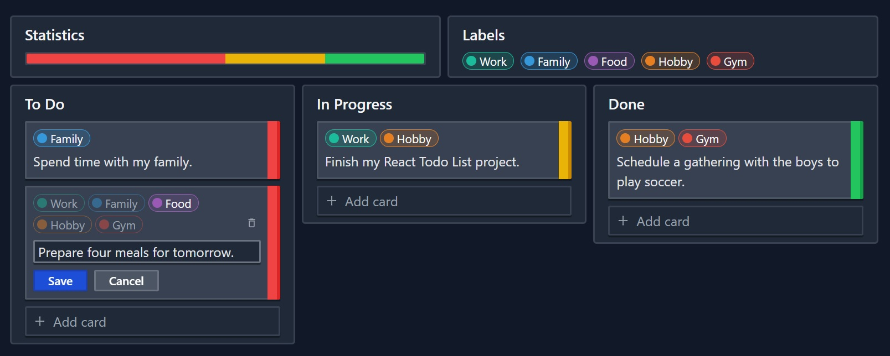

# React Todo
A to-do list application with labels and meter statistics.  
The cards are sortable by drag-n-drop. This functionality is built without a library. 
You can try the application out by visiting [this](https://0l1v3rr.github.io/react-todo) URL.



## Building from source
```sh
# 1. Clone the repo
git clone https://github.com/0l1v3rr/react-todo.git
cd wordle-clone

# 2. Install the necessary dependencies
npm i

# 3. Run the app
npm start
```
